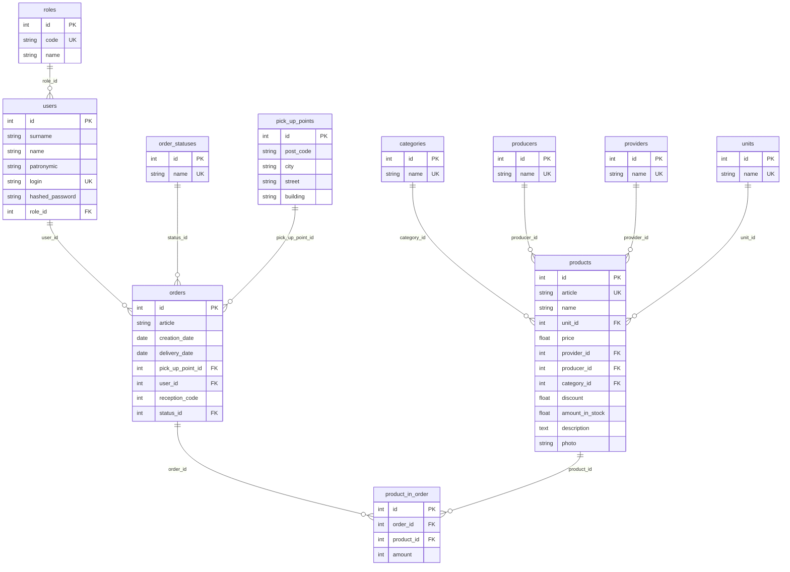

# ER-модель базы данных (экзамен, 3NF)

> Роль **«Гость»** не хранится в БД — только в приложении (без входа).

## Связи

| Связь | Тип | Пояснение |
|-------|-----|-----------|
| roles → users | 1:N | У пользователя одна роль |
| categories → products | 1:N | Товар в одной категории |
| producers → products | 1:N | У товара один производитель |
| providers → products | 1:N | У товара один поставщик |
| units → products | 1:N | У товара одна ед. измерения |
| users → orders | 1:N | Заказ оформляет пользователь |
| order_statuses → orders | 1:N | У заказа один статус |
| pick_up_points → orders | 1:N | Пункт выдачи для заказа |
| orders ↔ products | M:N | Через **product_in_order** (количество в `amount`) |
